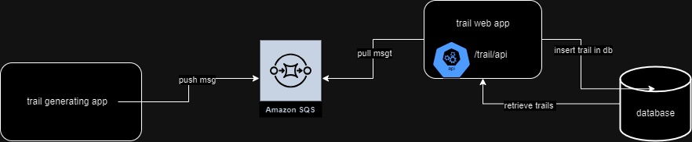

# audit-trail-app
Audit trail app

This is a web app that continously retrieves trails from SQS and puts them in RDS database.
Implementation is open to support different trail types, but for now only API trails are supported meaning trails of an HTTP API call are supported.

It exposes an API to retrieve trail records based on different parameters such as Request Method, Request Source etc.

API specs:

* Path: /trail/api
* Method: Post 
* Request Parameters
  * Request Source (IP address of client)
  * Request Method (HTTP method)
  * Request Path (Path to which request was made)
  * Successful (If the response was successful)

Database Table
* trail

| Column | Data Type | Default (Value) |
|-------|:----------|:---------------:|
 | id(PK)| bigint   | Auto Generated  |
| request_source | varchar(50) |       No        |
| request_method | varchar(10) |       No        |
| request_path | varchar(100) |       No        |
| request_body | varchar(1000) |       No        |
| response_body | varchar(1000) |       No        |
| successful | boolean |     Yes (Y)     |
| request_time | timestamp |   Yes (now())   |